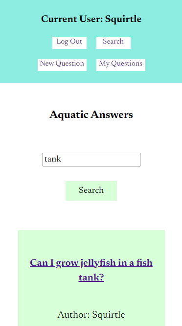
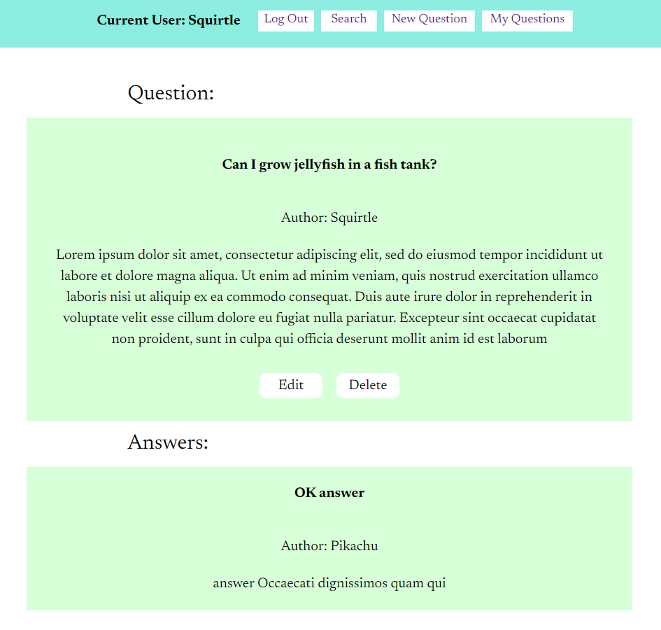
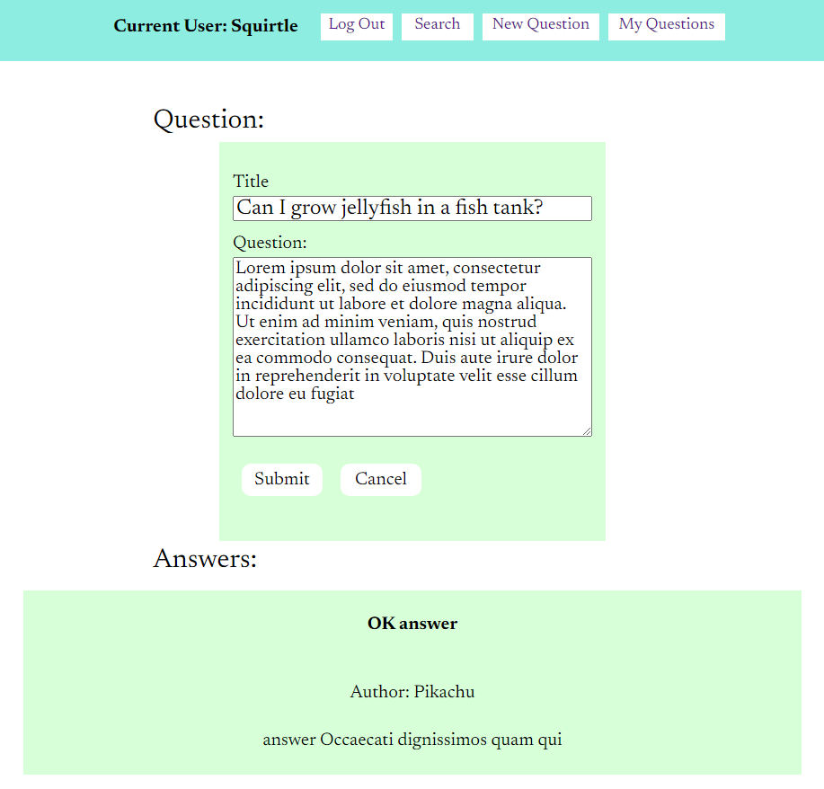

# Aquatic Answers (API)

Try out the app here: https://aquatic-app2.vercel.app/

Aquatic Answers Client repo: https://github.com/orndorfftyler/booktrove-app

### Summary

Aquatic Answers allows you to ask questions and get answers related to aquariums. All visitors to the site are able to search for questions that have already been asked and view their answers. After logging in or signing up, users may also post their own questions and post answers to other people's questions.

### Tech Used

Built with HTML, CSS, JavaScript, React, React Router, Node.js, Express, Knex, PostgresSQL.
Frontend deployed using Vercel. Backend deployed using Heroku.

### API Documentation

Aquatic App API endpoints:

POST /api/auth/login
- returns a JWT if user credentials are valid 

GET /api/questionsearch/:search_terms
- searches the questions table for entries matching the search terms
- returns a maximum of ten results

GET /api/questionsperuser/:user_id
- gets all questions written by a specific user

POST /api/questions/
- creates a new question

PATCH /api/questions/:question_id
- updates an existing question

DELETE /api/questions/:question_id
- deletes a question

GET /api/answersperquestion/:question_id
- gets all answers associated with a given question

POST /api/answers/:answer_id
- creates a new answer 

PATCH /api/answers/:answer_id
- updates an existing answer

DELETE /api/answers/:answer_id
- deletes an answer

### Screenshots

Search page (mobile view):

Question page:

Question page (edit mode):

